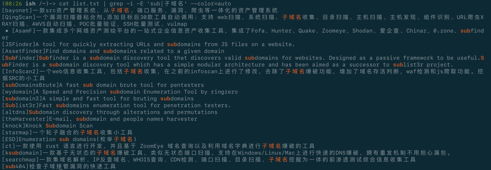

# JiuWei

**JiuWei - 一款灵活、多用途式网安类工具<u>列表</u>合集｜A collection of flexible and multi-purpose network security tools <u>list</u>**


## 使用声明

> 本工具仅面向合法授权的企业安全建设行为，用户滥用造成的一切后果与作者无关，在使用本工具时，您应确保该行为符合当地的法律法规，并且已经取得了足够的授权。请勿对非授权目标进行扫描。 

> 如您在使用本工具的过程中存在任何非法行为，您需自行承担相应后果，我们将不承担任何法律及连带责任. 您的使用行为或者您以其他任何明示或者默示方式表示接受本协议的，即视为您已阅读并同意本协议的约束。


## 优势&特点

- 不限定使用方式「*灵活自由*」
- 使用场景广泛「*宽领域*」
- 附带有各工具快速上手简介说明「*简介模板*」
- 附带有各工具快速安装命令列表「*快速安装*」
- 依赖更少，支持更多的Linux系统设备部署使用
- 重点工具标注「*快速选择优良工具使用*」


## 使用对象

1. 针对性攻击与漏洞扫描「红队」
2. 本地防御与漏洞检查「蓝队」
3. 工具开发者［快速查找同类工具，借鉴优势，补齐短板」
4. 日常网安工作者「学习工具原理代码，利用于日常挖洞」


## 快速部署

呀~心动不如行动

目前<u>该项目暂未公开</u>

现在你可以通过<u>加入QQ交流群</u>的方式获取项目文件「见联系部分」


## 依赖准备「安装Glass」

你可以选择不进行以下安装，直接使用cat替代glow

*尽管这样的查阅效果并不是很好*


### Ubuntu & Debian

安装glass命令「用于更好地查看md文件」

`sudo apt install glow`


### Fedora、RHEL 和其他基于 RPM 的发行版

```shell
echo ’[charm]
name=Charm
baseurl=https://repo.charm.sh/yum/
enabled=1
gpgcheck=1
gpgkey=https://repo.charm.sh/yum/gpg.key‘ | sudo tee /etc/yum.repos.d/charm.repo
```

然后键入以下命令安装 Glow：

`sudo yum install glow`


### Arch Linux 及其衍生产品

您可以使用默认包管理器 Pacman 在基于 Arch 的发行版上安装 Glow

`sudo pacman -S glow`


## 使用范例

> 查找工具简介中带有关键词的工具「可用于查找支持对应功能的工具」

`cat list.txt | grep -i -E ’sub|子域名‘ --color=auto` 




> 反向使用，查找对于工具的简介「防止因为本地工具冗杂而遗忘工具的用处与功能」

`cat list.txt | grep -i -E ’xray‘ --color=auto`


> 查找对应工具的安装命令与方式

`cat install.txt | grep -i -E ’xray‘ --color=auto`


> 查找对应工具的快速使用说明并查看


`ls demoes/xray*`

`glow demoes/xray.md` 


## 未来

- [ ] 完善快速安装命令列表
- [ ] 完善快速上手简介说明
- [ ] 对部分英文简介工具翻译处理
- [ ] 对部分简介过“简”的工具简介进行完善修改
- [ ] 可能会考虑添加快速更新命令列表


## 参考

[Kali Linux工具文档翻译计划](https://github.com/Jack-Liang/kalitools)


## 贡献&联系

你可以向我告知新的工具及其简介，为我的项目编写工具demo，为我完善工具的简介等等
希望各位大师傅踊跃贡献噢～～

1. [提交Github-iSSUES议题](https://github.com/HKTangyuan/JiuWei/issues)
2. [CSDN-TY汤圆](https://blog.csdn.net/qq_57851190)
3. [QQ-JiuWei交流群联系](https://qm.qq.com/cgi-bin/qm/qr?k=gv8UFPCxubqXOekIaX4olFkAjjyyy0fT&authKey=Kc/Bpl07783o9X0oXXVtK63VKNraq6wgvTsly4q9lYCZhRsJufX315DXkL6XvhtL&noverify=0)

【QQ群号：1004959223】

## 贡献名单「感谢各位大师傅的支持噢」


